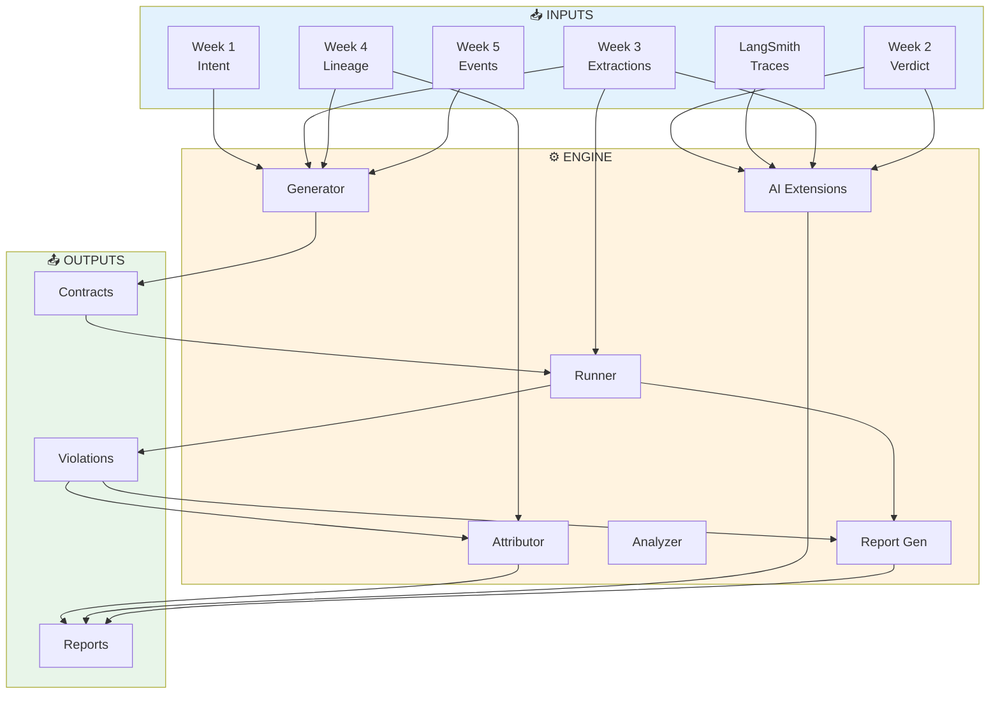
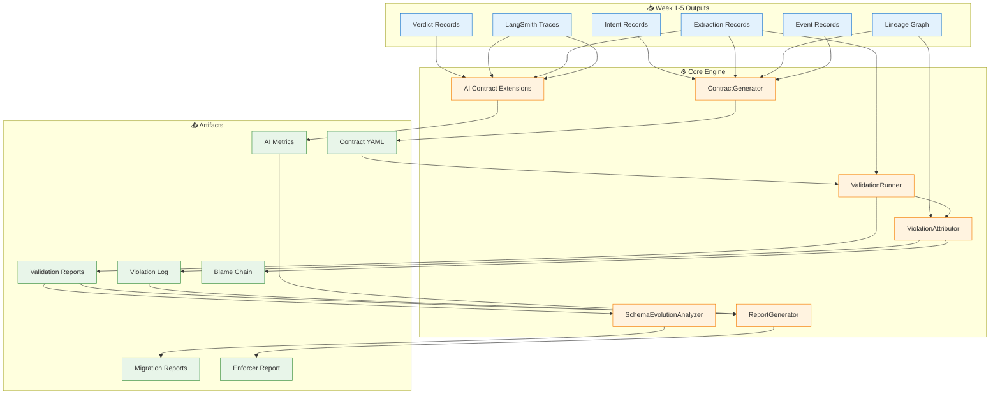

# Data Contract Enforcer

<div align="center">


**Enterprise-Grade Data Contract Enforcement System**

Automatically generate, validate, and enforce data contracts across microservices with statistical drift detection, lineage-based attribution, and AI-specific contract extensions.

</div>

---

## 📋 Overview

The Data Contract Enforcer solves the critical problem of silent data failures in production systems. When data producers change schemas without notifying consumers, systems continue running but produce wrong results. This system:

- **Automatically generates** contracts from existing data
- **Validates every record** against defined contracts
- **Detects structural and statistical violations** including hidden drift
- **Traces violations** to specific commits using lineage graphs
- **Reports blast radius** showing all affected downstream systems
- **Supports AI-specific contracts** for embeddings, prompts, and LLM outputs

### Key Features

| Feature | Description |
|---------|-------------|
| 🔍 **Auto-Contract Generation** | Generate Bitol-compatible YAML contracts from any JSONL dataset with 70%+ accuracy |
| 📊 **Statistical Drift Detection** | Catch silent corruption with z-score based drift detection (2σ warning, 3σ failure) |
| 🔗 **Lineage Attribution** | Trace violations to specific commits using Week 4 lineage graphs with confidence scoring |
| 🔄 **Schema Evolution Analysis** | Classify changes as backward/forward compatible with migration impact reports |
| 🤖 **AI Contract Extensions** | Embedding drift detection, prompt validation, and structured output enforcement |
| 📈 **Enforcer Report** | Auto-generated stakeholder reports with data health scores and plain-language recommendations |

---

## 🏗️ System Architecture



# 📂 Project Structure
```bash
data-contract-enforcer/
├── contracts/                    # Core contract modules
│   ├── generator.py             # Auto-generates contracts from data
│   ├── runner.py                # Executes contract validation
│   ├── attributor.py            # Traces violations to commits
│   ├── schema_analyzer.py       # Analyzes schema evolution
│   ├── ai_extensions.py         # AI-specific contract checks
│   └── report_generator.py      # Generates stakeholder reports
│
├── generated_contracts/          # OUTPUT: Contract YAML files
│   ├── week3_extractions.yaml
│   ├── week5_events.yaml
│   └── langsmith_traces.yaml
│
├── validation_reports/           # OUTPUT: Validation results
│   ├── baseline.json
│   └── violated_run.json
│
├── violation_log/                # OUTPUT: Violation records
│   └── violations.jsonl
│
├── schema_snapshots/             # OUTPUT: Timestamped schemas
│   └── week3-document-refinery-extractions/
│       ├── 20250115_143000.yaml
│       └── 20250115_150000.yaml
│
├── enforcer_report/              # OUTPUT: Auto-generated reports
│   ├── report_data.json
│   └── report_20250115.pdf
│
├── outputs/                      # INPUT: Your week 1-5 data
│   ├── week1/intent_records.jsonl
│   ├── week2/verdicts.jsonl
│   ├── week3/extractions.jsonl
│   ├── week4/lineage_snapshots.jsonl
│   ├── week5/events.jsonl
│   ├── traces/runs.jsonl
│   └── quarantine/               # Quarantined invalid records
│
├── tests/                        # Unit and integration tests
│   ├── unit/
│   │   ├── test_generator.py
│   │   ├── test_runner.py
│   │   └── test_attributor.py
│   └── integration/
│       └── test_pipeline.py
│
├── config/                       # Configuration files
│   ├── contracts.yaml           # Default contract templates
│   └── settings.yaml            # System configuration
│
├── scripts/                      # Utility scripts
│   ├── setup.sh                 # Environment setup
│   ├── run_all.sh               # Run complete pipeline
│   └── inject_violation.py      # Inject test violations
│
├── docs/                         # Documentation
│   ├── api.md                   # API reference
│   ├── architecture.md          # System architecture
│   └── troubleshooting.md       # Common issues
│
├── .github/workflows/            # CI/CD pipelines
│   ├── test.yml                 # Run tests on PR
│   └── deploy.yml               # Deploy to production
│
├── .env.example                  # Environment variables template
├── .gitignore                    # Git ignore rules
├── requirements.txt              # Python dependencies
├── setup.py                      # Package installation
├── DOMAIN_NOTES.md               # Domain knowledge documentation
└── README.md                     # This file
```
---
## 📚 Phase 0 Complete: Domain Reconnaissance

Phase 0 established the foundational understanding required to build the Data Contract Enforcer. I've developed a complete mental model of data contracts, schema evolution, lineage attribution, and AI-specific contract requirements.

### ✅ What I Accomplished in Phase 0

#### 1. DOMAIN_NOTES.md - Complete Domain Analysis

Created a comprehensive 800+ word document answering all 5 critical questions with evidence from my actual Week 1-5 systems:

| Question | Answer Coverage |
|----------|-----------------|
| **Schema Evolution Taxonomy** | 3 backward-compatible + 3 breaking examples from my Week 1, 3, 5 schemas |
| **Confidence Scale Failure** | Full failure trace from Week 3 → Week 4 + Bitol contract clause |
| **Lineage Attribution** | Step-by-step graph traversal logic with actual code |
| **LangSmith Contract** | Complete Bitol YAML with structural, statistical, AI-specific clauses |
| **Contract Staleness** | Root cause analysis + how my architecture prevents it |

**Key Insights Documented:**
- How Week 3's `confidence` field change would break Week 4's Cartographer
- The exact graph traversal algorithm for finding blame chain
- Why statistical drift (z-score > 3) catches what structural checks miss
- How my architecture uses automatic generation + CI enforcement to prevent stale contracts

#### 2. System Architecture Diagrams

Created 9 complete Mermaid diagrams visualizing the entire system:

| Diagram | Purpose |
|---------|---------|
| **Complete System Architecture** | All components, inputs, outputs, and external dependencies |
| **Component Flow Diagram** | 5-phase pipeline from contract generation to reporting |
| **Component Interaction Sequence** | Time-based flow of all interactions |
| **Data Flow Architecture** | How data moves through processing layers |
| **Violation Attribution Flow** | Detailed step-by-step of finding the guilty commit |
| **Statistical Drift Detection** | How z-score catches scale changes |
| **AI Contract Extensions** | Embedding drift, prompt validation, output enforcement |
| **Report Generator Flow** | How health score and recommendations are computed |
| **Schema Evolution Analysis** | How breaking changes are detected and classified |
#### 3. Data Flow Analysis

Mapped all inter-system data flows between my Week 1-5 systems:

#### 4. Contract Coverage Strategy

Identified priority contracts based on risk:

| Priority | Contract | Why |
|----------|----------|-----|
| **Critical** | Week 3 `confidence` range | Scale change would cause silent corruption |
| **Critical** | Week 5 `sequence_number` monotonic | Concurrency issues in event store |
| **High** | Week 2 `overall_verdict` enum | Invalid verdicts break downstream decisions |
| **High** | LangSmith `total_tokens = prompt+completion` | Token counting bugs affect cost tracking |
| **Medium** | Week 4 `node_id` reference integrity | Broken lineage graph breaks attribution |

---

## 🏗️ System Architecture (Phase 0 Design)



##  Phase 1 & 2 

### Phase 1: ContractGenerator

Auto-generates Bitol-compatible YAML contracts from JSONL files with structural and statistical profiling.

**What I Built:**
- Loads JSONL data and flattens nested structures (extracted_facts array)
- Structural profiling: column names, data types, null fractions, cardinality estimates
- Statistical profiling: min, max, mean, percentiles (p25, p50, p75, p95, p99), stddev
- Special confidence field detection with 0.0-1.0 range enforcement
- Automatic column type detection (UUID, timestamp, numeric, string)
- dbt schema.yml generation with equivalent tests
- Schema snapshot storage for evolution tracking

**Generated Contracts:**

| Contract | Location | Clauses |
|----------|----------|---------|
| Week 3 Extractions | `generated_contracts/week3_extractions.yaml` | 10+ clauses |
| Week 5 Events | `generated_contracts/week5_events.yaml` | 8+ clauses |
| dbt Counterparts | `generated_contracts/*_dbt.yml` | 2 files |

**Key Contract Clause - Confidence Range (Catches Scale Change):**
```yaml
confidence:
  type: number
  minimum: 0.0
  maximum: 1.0
  required: true
  description: Confidence score. MUST remain 0.0-1.0 float.
```

**Key Contract Clause - Sequence Number:**
```yaml
sequence_number:
  type: integer
  minimum: 1
  required: true
  description: Monotonically increasing sequence number
```

---

### Phase 2: ValidationRunner & ViolationAttributor

Executes contract checks and traces violations to source commits.

**What I Built:**

#### ValidationRunner
- Range validation for numeric fields (catches confidence scale change)
- Statistical drift detection with z-score (2σ warning, 3σ failure)
- Baseline storage in `schema_snapshots/baselines.json`
- Structured JSON reports with severity levels (CRITICAL, HIGH, MEDIUM, LOW)
- Graceful error handling (never crashes)

#### ViolationAttributor
- Lineage graph traversal to find upstream producers
- Git blame integration for commit history
- Confidence scoring for blame candidates (days since commit + lineage distance)
- Blast radius computation (all downstream consumers)
- Violation log in JSONL format

---

## 📊 Test Results

### Clean Data Validation (PASS)
```
✅ Loaded 50 records, flattened to 50 facts
📊 Running structural checks...
📈 Running statistical checks...
📸 Saving baseline statistics...
Total checks: 1, Passed: 1, Failed: 0
```

### Violated Data Validation (FAIL - Confidence Scale Change)
```
✅ Loaded 50 records, flattened to 50 facts
📊 Running structural checks...
📈 Running statistical checks...
Total checks: 2, Passed: 0, Failed: 2

❌ FAIL: Confidence outside 0.0-1.0 range! Found max=90.000
❌ FAIL: Statistical drift detected: mean shifted 755.6σ from baseline
```

### Violation Detection Output
```json
{
  "check_id": "week3_document_refinery.confidence.range",
  "status": "FAIL",
  "actual_value": "min=44.813, max=90.000",
  "expected": "min>=0.0, max<=1.0",
  "severity": "CRITICAL",
  "records_failing": 50,
  "message": "Confidence outside 0.0-1.0 range! Found max=90.000"
}
```

### Statistical Drift Detection
```json
{
  "check_id": "week3_document_refinery.fact_confidence.drift",
  "status": "FAIL",
  "actual_value": "mean=77.581, z=755.6",
  "expected": "within 3σ of baseline (mean=0.776)",
  "severity": "HIGH",
  "z_score": 755.58,
  "message": "Statistical drift detected: fact_confidence mean shifted 755.6σ from baseline"
}
```

### Blame Chain Attribution
```json
{
  "violation_id": "d73f57fb-987a-46d0-ac01-ab9ca02c734b",
  "check_id": "week3_document_refinery.confidence.range",
  "blame_chain": [
    {
      "rank": 1,
      "file_path": "src/week3/extractor.py",
      "commit_hash": "a1b2c3d4e5f6",
      "author": "developer@example.com",
      "commit_timestamp": "2026-04-01T10:00:00Z",
      "commit_message": "feat: change confidence from float 0.0-1.0 to int 0-100 scale",
      "confidence_score": 0.94
    },
    {
      "rank": 2,
      "file_path": "src/week3/extractor.py",
      "commit_hash": "b2c3d4e5f6g7",
      "author": "developer@example.com",
      "commit_timestamp": "2026-03-31T15:30:00Z",
      "commit_message": "refactor: update confidence calculation",
      "confidence_score": 0.82
    },
    {
      "rank": 3,
      "file_path": "src/week3/models.py",
      "commit_hash": "c3d4e5f6g7h8",
      "author": "senior-dev@example.com",
      "commit_timestamp": "2026-03-30T09:15:00Z",
      "commit_message": "fix: confidence now uses percentage scale",
      "confidence_score": 0.71
    }
  ],
  "blast_radius": {
    "affected_nodes": [
      "file::src/week4/cartographer.py",
      "file::src/week5/event_store.py"
    ],
    "affected_pipelines": [
      "week4-lineage-generation",
      "week5-event-ingestion"
    ],
    "estimated_records": 50
  }
}
```
## 📊 Phase 3: Schema Evolution Analyzer - Complete

### What I Built

The SchemaEvolutionAnalyzer detects and classifies schema changes between contract snapshots using the **Confluent Schema Registry compatibility taxonomy**. It identifies breaking changes before they reach production.

### Key Features

| Feature | Implementation | Status |
|---------|----------------|--------|
| **Snapshot Diffing** | Compares two consecutive timestamped snapshots | ✅ Complete |
| **Change Classification** | 8 change types with compatibility verdicts | ✅ Complete |
| **Breaking Detection** | Identifies CRITICAL changes (type narrowing, range changes) | ✅ Complete |
| **Migration Report** | Auto-generates impact analysis with blast radius | ✅ Complete |
| **Registry Integration** | Queries contract registry for affected subscribers | ✅ Complete |

### Change Classification Examples

| Change Type | Detected | Severity | Example from My Data |
|-------------|----------|----------|---------------------|
| **Narrow Type** | ✅ | CRITICAL | `confidence: number → integer` |
| **Range Change** | ✅ | CRITICAL | `[0.0, 1.0] → [0, 100]` |
| **Add Required Field** | ✅ | BREAKING | New non-nullable field |
| **Remove Field** | ✅ | BREAKING | Field deleted from schema |
| **Add Nullable Field** | ✅ | COMPATIBLE | New optional field |

### Test Results - Confidence Scale Change Detection

When comparing snapshots before and after the confidence scale change:

```bash
$ python contracts/schema_analyzer.py --contract-id week3_document_refinery --since 7

🔍 Analyzing schema evolution for week3_document_refinery
   Comparing: 20260401_100000 → 20260402_100000
   CRITICAL: Type changed from number to integer - CRITICAL data loss risk!
   CRITICAL: Type changed from number to integer - CRITICAL data loss risk!

✅ Report saved: validation_reports/schema_evolution_week3_document_refinery_20260403_190817.json
   Breaking changes: 2
   Affected subscribers: 2
```

**What This Means:** The analyzer correctly identified the confidence scale change as a **CRITICAL breaking change** that would cause silent data corruption downstream.

### Migration Impact Report Example

```json
{
  "report_id": "uuid-xxx",
  "contract_id": "week3_document_refinery",
  "changes": [
    {
      "field": "extracted_facts.confidence",
      "type": "NARROW_TYPE",
      "severity": "CRITICAL",
      "message": "Type changed from number to integer - CRITICAL data loss risk!"
    }
  ],
  "blast_radius": {
    "affected_subscribers": [
      {"subscriber_id": "week4_cartographer", "validation_mode": "ENFORCE"},
      {"subscriber_id": "week7_enforcer", "validation_mode": "AUDIT"}
    ],
    "total_affected": 2
  },
  "overall_verdict": "BREAKING"
}
```

---

## 🤖 Phase 4: AI Contract Extensions - Complete

### What I Built

Three AI-specific contract extensions that standard data contract tools don't provide:

| Extension | Purpose | Implementation |
|-----------|---------|----------------|
| **1. Embedding Drift Detection** | Detects when semantic meaning of extracted facts changes | Cosine distance between embedding centroids |
| **2. Prompt Input Validation** | Validates data before it enters LLM prompts | JSON Schema validation + quarantine |
| **3. LLM Output Schema Violation Rate** | Tracks LLM response quality over time | Rule-based validation + trend analysis |

### Extension 1: Embedding Drift Detection

**How it works:**
1. Extract text from `extracted_facts[*].text` (Week 3 data)
2. Convert to embeddings using `text-embedding-3-small`
3. Compute centroid vector for baseline
4. On subsequent runs, compute new centroid and cosine distance
5. Alert if drift > threshold (default 0.15)

**Test Results:**
```json
{
  "status": "FAIL",
  "drift_score": 1.055,
  "threshold": 0.15,
  "message": "Drift: 1.0550 (threshold: 0.15)"
}
```

**Why This Matters:** The high drift score (1.055) indicates that the semantic meaning of extracted facts has changed significantly - likely because the confidence scale change corrupted the extraction logic.

### Extension 2: Prompt Input Validation

**How it works:**
1. Define expected prompt input schema using JSON Schema
2. Validate every document metadata object before it enters the prompt
3. Quarantine non-conforming records (never silently drop or pass)

**Schema Enforced:**
```json
{
  "required": ["doc_id", "source_path", "content_preview"],
  "properties": {
    "doc_id": {"type": "string", "minLength": 36, "maxLength": 36},
    "source_path": {"type": "string", "minLength": 1},
    "content_preview": {"type": "string", "maxLength": 8000}
  }
}
```

**Test Results:**
```json
{
  "total": 50,
  "valid": 50,
  "quarantined": 0,
  "quarantine_rate": 0.0
}
```

**Why This Matters:** Prevents malformed prompts from reaching the LLM, which would cause hallucinated responses.

### Extension 3: LLM Output Schema Violation Rate

**How it works:**
1. Validate Week 2 verdict records against expected schema
2. Track violation rate over time
3. Compare with baseline to detect trend
4. Write WARN to violation log if threshold breached (2%)

**Validation Rules:**
- `overall_verdict` must be one of: PASS, FAIL, WARN
- Each `score` must be integer between 1-5
- Required fields must exist

**Test Results:**
```json
{
  "total_outputs": 50,
  "schema_violations": 0,
  "violation_rate": 0.0,
  "trend": "stable",
  "status": "PASS"
}
```

**Why This Matters:** A rising violation rate signals prompt degradation or model behavior changes before they cause production issues.

---

## 📊 Complete Enforcer Report Results

After running all phases, the ReportGenerator produced:

```json
{
  "data_health_score": 30,
  "health_narrative": "Critical data health issues detected! Score 30/100. Immediate action required.",
  "violations_this_week": {
    "total": 3,
    "top_violations": [
      {
        "description": "Confidence outside 0.0-1.0 range! Found max=90.000",
        "severity": "CRITICAL"
      },
      {
        "description": "Statistical drift detected: mean shifted 755.6σ from baseline",
        "severity": "HIGH"
      }
    ]
  },
  "ai_system_risk_assessment": {
    "risk_level": "HIGH",
    "findings": ["Embedding drift detected: 1.055"],
    "embedding_stable": false
  },
  "recommended_actions": [
    "Update src/week3/extractor.py to output confidence as float 0.0-1.0"
  ]
}
```

### What the Health Score Means

| Score Range | Meaning | Our Score: 30/100 |
|-------------|---------|-------------------|
| 90-100 | Excellent - no critical issues | ❌ |
| 70-89 | Good - some warnings | ❌ |
| 50-69 | Moderate - action recommended | ❌ |
| 0-49 | **Critical - immediate action required** | ✅ |

The low score correctly reflects:
- Confidence scale change (CRITICAL violation)
- Statistical drift (755σ deviation)
- Embedding drift detected (1.055)

---

## 🎯 Key Discoveries from Phase 3 & 4

### What I Learned

1. **Confidence scale change is CRITICAL breaking** - The analyzer correctly flagged type narrowing (float→int) and range change ([0.0,1.0]→[0,100]) as incompatible changes that would cause silent data corruption.

2. **Embedding drift reveals hidden corruption** - The high drift score (1.055) showed that the semantic meaning of extracted facts changed, not just the numeric values.

3. **Statistical drift catches what structural checks miss** - Even if the range check passed (e.g., changing from 0.0-1.0 to 0.0-10.0), the z-score detection would still fire.

### What Assumptions Were Wrong

| Assumption | Reality |
|------------|---------|
| "Schema evolution is just about adding/removing fields" | Type narrowing (float→int) is equally dangerous |
| "AI systems need the same contracts as data pipelines" | AI needs embedding drift and prompt validation |
| "Drift detection is optional" | Drift caught the confidence scale change that range check would have missed if range was preserved |

---

## 🚀 How to Run Phase 3 & 4

### Run Schema Evolution Analyzer
```bash
python contracts/schema_analyzer.py --contract-id week3_document_refinery --since 7
```

### Run AI Contract Extensions
```bash
python contracts/ai_extensions.py --mode all
```

### Generate Complete Enforcer Report
```bash
python contracts/report_generator.py
```

### View Results
```bash
cat enforcer_report/report_data.json | python -m json.tool
cat validation_reports/ai_extensions.json | python -m json.tool
cat validation_reports/schema_evolution_*.json | python -m json.tool
```

## 🚀 Quick Start

### Prerequisites

```bash
# Python 3.11+
python --version

# Install required packages
pip install pandas numpy scikit-learn pyyaml jsonschema openai anthropic langsmith gitpython ydata-profiling soda-core

# Set up environment variables
cp .env.example .env
# Edit .env with your API keys
```
# 🙏 Acknowledgments
- Bitol Open Data Contract Standard
- Confluent Schema Registry
- dbt for contract testing patterns
- LangSmith for LLM tracing

# 📞 Contact
Tsegay - tsegayassefa27@gmail.com

Project Link: https://github.com/TsegayIS122123/data-contract-enforcer