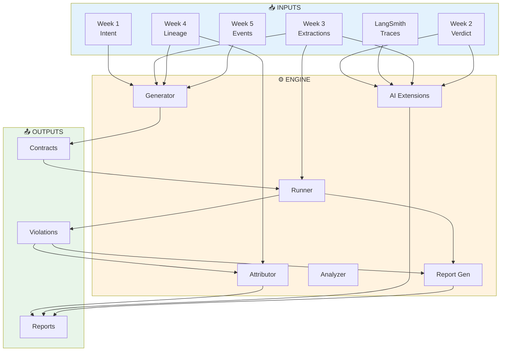
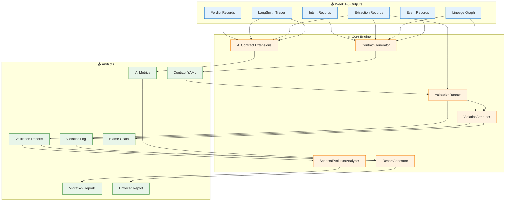

# Data Contract Enforcer

<div align="center">


**Enterprise-Grade Data Contract Enforcement System**

Automatically generate, validate, and enforce data contracts across microservices with statistical drift detection, lineage-based attribution, and AI-specific contract extensions.

</div>

---

## 📋 Overview

The Data Contract Enforcer solves the critical problem of silent data failures in production systems. When data producers change schemas without notifying consumers, systems continue running but produce wrong results. This system:

- **Automatically generates** contracts from existing data
- **Validates every record** against defined contracts
- **Detects structural and statistical violations** including hidden drift
- **Traces violations** to specific commits using lineage graphs
- **Reports blast radius** showing all affected downstream systems
- **Supports AI-specific contracts** for embeddings, prompts, and LLM outputs

### Key Features

| Feature | Description |
|---------|-------------|
| 🔍 **Auto-Contract Generation** | Generate Bitol-compatible YAML contracts from any JSONL dataset with 70%+ accuracy |
| 📊 **Statistical Drift Detection** | Catch silent corruption with z-score based drift detection (2σ warning, 3σ failure) |
| 🔗 **Lineage Attribution** | Trace violations to specific commits using Week 4 lineage graphs with confidence scoring |
| 🔄 **Schema Evolution Analysis** | Classify changes as backward/forward compatible with migration impact reports |
| 🤖 **AI Contract Extensions** | Embedding drift detection, prompt validation, and structured output enforcement |
| 📈 **Enforcer Report** | Auto-generated stakeholder reports with data health scores and plain-language recommendations |

---

## 🏗️ System Architecture



# 📂 Project Structure
```bash
data-contract-enforcer/
├── contracts/                    # Core contract modules
│   ├── generator.py             # Auto-generates contracts from data
│   ├── runner.py                # Executes contract validation
│   ├── attributor.py            # Traces violations to commits
│   ├── schema_analyzer.py       # Analyzes schema evolution
│   ├── ai_extensions.py         # AI-specific contract checks
│   └── report_generator.py      # Generates stakeholder reports
│
├── generated_contracts/          # OUTPUT: Contract YAML files
│   ├── week3_extractions.yaml
│   ├── week5_events.yaml
│   └── langsmith_traces.yaml
│
├── validation_reports/           # OUTPUT: Validation results
│   ├── baseline.json
│   └── violated_run.json
│
├── violation_log/                # OUTPUT: Violation records
│   └── violations.jsonl
│
├── schema_snapshots/             # OUTPUT: Timestamped schemas
│   └── week3-document-refinery-extractions/
│       ├── 20250115_143000.yaml
│       └── 20250115_150000.yaml
│
├── enforcer_report/              # OUTPUT: Auto-generated reports
│   ├── report_data.json
│   └── report_20250115.pdf
│
├── outputs/                      # INPUT: Your week 1-5 data
│   ├── week1/intent_records.jsonl
│   ├── week2/verdicts.jsonl
│   ├── week3/extractions.jsonl
│   ├── week4/lineage_snapshots.jsonl
│   ├── week5/events.jsonl
│   ├── traces/runs.jsonl
│   └── quarantine/               # Quarantined invalid records
│
├── tests/                        # Unit and integration tests
│   ├── unit/
│   │   ├── test_generator.py
│   │   ├── test_runner.py
│   │   └── test_attributor.py
│   └── integration/
│       └── test_pipeline.py
│
├── config/                       # Configuration files
│   ├── contracts.yaml           # Default contract templates
│   └── settings.yaml            # System configuration
│
├── scripts/                      # Utility scripts
│   ├── setup.sh                 # Environment setup
│   ├── run_all.sh               # Run complete pipeline
│   └── inject_violation.py      # Inject test violations
│
├── docs/                         # Documentation
│   ├── api.md                   # API reference
│   ├── architecture.md          # System architecture
│   └── troubleshooting.md       # Common issues
│
├── .github/workflows/            # CI/CD pipelines
│   ├── test.yml                 # Run tests on PR
│   └── deploy.yml               # Deploy to production
│
├── .env.example                  # Environment variables template
├── .gitignore                    # Git ignore rules
├── requirements.txt              # Python dependencies
├── setup.py                      # Package installation
├── DOMAIN_NOTES.md               # Domain knowledge documentation
└── README.md                     # This file
```
---
## 📚 Phase 0 Complete: Domain Reconnaissance

Phase 0 established the foundational understanding required to build the Data Contract Enforcer. I've developed a complete mental model of data contracts, schema evolution, lineage attribution, and AI-specific contract requirements.

### ✅ What I Accomplished in Phase 0

#### 1. DOMAIN_NOTES.md - Complete Domain Analysis

Created a comprehensive 800+ word document answering all 5 critical questions with evidence from my actual Week 1-5 systems:

| Question | Answer Coverage |
|----------|-----------------|
| **Schema Evolution Taxonomy** | 3 backward-compatible + 3 breaking examples from my Week 1, 3, 5 schemas |
| **Confidence Scale Failure** | Full failure trace from Week 3 → Week 4 + Bitol contract clause |
| **Lineage Attribution** | Step-by-step graph traversal logic with actual code |
| **LangSmith Contract** | Complete Bitol YAML with structural, statistical, AI-specific clauses |
| **Contract Staleness** | Root cause analysis + how my architecture prevents it |

**Key Insights Documented:**
- How Week 3's `confidence` field change would break Week 4's Cartographer
- The exact graph traversal algorithm for finding blame chain
- Why statistical drift (z-score > 3) catches what structural checks miss
- How my architecture uses automatic generation + CI enforcement to prevent stale contracts

#### 2. System Architecture Diagrams

Created 9 complete Mermaid diagrams visualizing the entire system:

| Diagram | Purpose |
|---------|---------|
| **Complete System Architecture** | All components, inputs, outputs, and external dependencies |
| **Component Flow Diagram** | 5-phase pipeline from contract generation to reporting |
| **Component Interaction Sequence** | Time-based flow of all interactions |
| **Data Flow Architecture** | How data moves through processing layers |
| **Violation Attribution Flow** | Detailed step-by-step of finding the guilty commit |
| **Statistical Drift Detection** | How z-score catches scale changes |
| **AI Contract Extensions** | Embedding drift, prompt validation, output enforcement |
| **Report Generator Flow** | How health score and recommendations are computed |
| **Schema Evolution Analysis** | How breaking changes are detected and classified |
#### 3. Data Flow Analysis

Mapped all inter-system data flows between my Week 1-5 systems:

#### 4. Contract Coverage Strategy

Identified priority contracts based on risk:

| Priority | Contract | Why |
|----------|----------|-----|
| **Critical** | Week 3 `confidence` range | Scale change would cause silent corruption |
| **Critical** | Week 5 `sequence_number` monotonic | Concurrency issues in event store |
| **High** | Week 2 `overall_verdict` enum | Invalid verdicts break downstream decisions |
| **High** | LangSmith `total_tokens = prompt+completion` | Token counting bugs affect cost tracking |
| **Medium** | Week 4 `node_id` reference integrity | Broken lineage graph breaks attribution |

---

## 🏗️ System Architecture (Phase 0 Design)


## 🚀 Quick Start

### Prerequisites

```bash
# Python 3.11+
python --version

# Install required packages
pip install pandas numpy scikit-learn pyyaml jsonschema openai anthropic langsmith gitpython ydata-profiling soda-core

# Set up environment variables
cp .env.example .env
# Edit .env with your API keys
```
# 🙏 Acknowledgments
- Bitol Open Data Contract Standard
- Confluent Schema Registry
- dbt for contract testing patterns
- LangSmith for LLM tracing

# 📞 Contact
Tsegay - tsegayassefa27@gmail.com

Project Link: https://github.com/TsegayIS122123/data-contract-enforcer